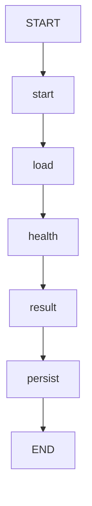

## Data Flow

This project runs a deterministic photo-analysis pipeline for camera health checks.

### 1 CLI bootstrap

The command entrypoint resolves a run as:

1. `python -m detection_face.entrypoints.cli` calls `entrypoints/cli/__main__.py`.
2. If no subcommand is provided, it defaults to `analyze`.
3. `entrypoints/cli/analyze.py` loads:
   - `configs/global.yaml` for shared runtime settings.
   - `configs/camera_health.yaml` for health thresholds.
4. `next_version()` selects `artifacts/runs/version_N` and initializes `run_dir`.
5. `build_pipeline(...)` wires pipeline dependencies in `composition.py`:
   - `CheckCameraHealth` use case.
   - `CVImageReader`.
   - `FilesystemPredictionWriter`.
   - `FilesystemRunLogger`.

### 2 Pipeline graph execution

`AnalyzePhotoPipeline.run(path)` delegates to a LangGraph graph built by `build_analyze_photo_graph`.

Flow:

Node behavior:

- `start`: records wall-clock start timestamp (`start_ts`).
- `load`: reads image bytes from disk via `CVImageReader` into `Image`.
- `health`: executes `CheckCameraHealth`, producing `CameraHealthResult`.
- `result`: wraps health status in `AnalyzePhotoResult`.
- `persist`: writes the result and logs timing metadata.

### 3 Output artifacts

For each input image:

- `predictions/json/<image_stem>.json`
  - written by `FilesystemPredictionWriter`.
  - stores image identity (`image_id`, `path`, `shape`) and `camera_health`.
- `logs/inference.log`
  - append-style info logs from `FilesystemRunLogger`.
  - line format includes file name, `healthy`, `health` duration, and `total` duration.
- Optional Mermaid graph
  - when `--save-graph` is set, `pipeline.mmd` is written under `diagram/`.

### 4 Health semantics

Current health policy:

- `CameraHealthResult.is_black`: true when `np.mean(image.data) < black_threshold`.
- `CameraHealthResult.is_healthy`: true when the image is not black.
